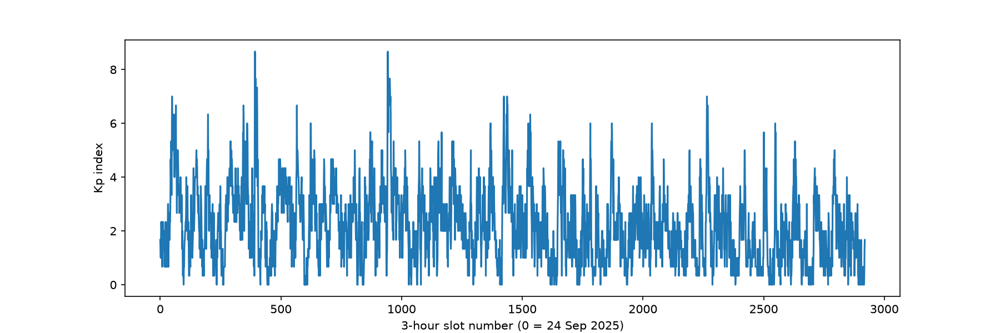

# Aurora Borealis

## The phenomenon

The aurora is driven by disturbances in Earth's magnetic field, and those disturbances are measured all the time, whether or not anyone is looking at the sky. The standard measure is the **Kp index**, a number from 0 to 9 reported for every 3-hour window. Around 0 to 2 is calm, 5 or more counts as a geomagnetic storm, and 9 is the most extreme. I looked at a full year of it because I wanted to see how rarely the sky really gets going, and when.

## The source

The numbers come from **GFZ Helmholtz Centre for Geosciences, Potsdam**, which produces the official Kp index. The data is licensed CC BY 4.0, and I credit GFZ Potsdam as the source.

- Data page: https://kp.gfz.de/en/data
- Exact address I fetched (once): https://kp.gfz.de/app/json/?start=2025-09-24T00:00:00Z&end=2026-09-23T23:59:59Z&index=Kp

The file is `data/kp-1year.json`, saved exactly as it arrived. It holds **2,920 values**, one per 3-hour slot, from 24 September 2025 00:00 to 23 September 2026 21:00 (UTC). Each value is a unitless Kp number between 0 and 9, given in thirds (for example 1.667). A `status` list marks each value as `def` (definitive) or `pre` (preliminary). The last 184 values, from 1 September 2026, are preliminary and may still be revised.

## The picture



*(This is my first, plain version. It will be replaced by the aurora version.)*

## What it shows, and what it hides

Most of the year is calm: 2,559 of the 2,920 slots are below Kp 4. Only 133 slots reach storm level (Kp 5 or more), and they arrive in short bursts. The strongest reached Kp 8.667, on 12 November 2025 and on 19 January 2026.

It hides a lot. Kp is an average across magnetometers at mid-latitudes, so it says nothing about what anyone can see from one particular place. It is also a 3-hour figure, so short bursts inside a window are smoothed away. And it measures magnetic disturbance, not the aurora itself: cloud, daylight and location decide whether anyone actually sees anything. Kp contains no colour information either, so any colours I add later are my own choice and not something that was measured.

## How to run it

```
uv run plot.py
```