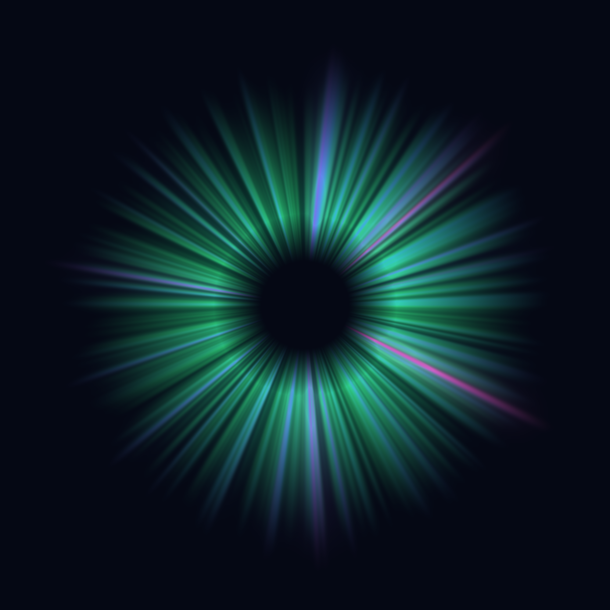

# Aurora Borealis

A year of geomagnetic activity, drawn as a ring of light.

## The phenomenon

The aurora happens when charged particles from the sun disturb Earth's magnetic field. That disturbance is measured all the time, whether or not anyone is looking at the sky. The standard measure is the **Kp index**, a number from 0 to 9 reported for every 3-hour window. Low values mean a calm field, 5 or more counts as a geomagnetic storm (level G1 on NOAA's scale), and 9 is the most extreme. I looked at a full year because I wanted to see how rarely the sky really gets going, and when. I chose the aurora because it has always fascinated me as something I know is scientifically explained but that cannot help but feel magical. I think it fits well with this assigment -- representing something of the STEM world as an artwork that feels magical instead of just a collection of dates on axes.

## The source

The numbers come from the **GFZ German Research Centre for Geosciences in Potsdam**, which produces the official Kp index from magnetometer stations around the world.

- Data page: https://kp.gfz.de/en/data
- The exact address I fetched (once): https://kp.gfz.de/app/json/?start=2025-09-24T00:00:00Z&end=2026-09-23T23:59:59Z&index=Kp

The file is `data/kp-1year.json`, saved exactly as it arrived. It holds **2,920 readings**, one for every 3-hour window from 24 September 2025 00:00 to 23 September 2026 21:00 (UTC). Each reading is a Kp value between 0 and 9 with no unit, given in thirds (for example 1.667). A `status` list marks each reading as definitive (`def`) or preliminary (`pre`). The last 184 readings, from 1 September 2026, are preliminary and may still be revised.

The data is licensed CC BY 4.0. Credit: GFZ Potsdam, Kp index, https://doi.org/10.5880/Kp.0001

## The picture



The year is wrapped into a circle like a clock face. It starts at 12 o'clock (24 September 2025) and runs clockwise: about 24 December is at 3, about 25 March at 6, and about 24 June at 9, and the end of the year meets the start. Each 3-hour Kp reading is a ray of light streaming outward from the dark centre. Higher Kp means a longer ray and a different colour: green when calm, then teal and blue, then purple, pink and red as a storm builds. The two pink streaks are the strongest storms (Kp 8.7): 12 November 2025, between 1 and 2 o'clock, and 19 to 21 January 2026, just before 4. Thinner lilac streaks mark three storms of Kp 7: 30 September 2025 just after 12, 20 to 22 March 2026 just before 6, and 4 July 2026 just after 9. The shorter blue and teal rays around them are weaker activity.

## What it shows, and what it hides

Most of the year was calm: 2,559 of the 2,920 readings are below Kp 4, and only 133 reach storm level (Kp 5 or more). The strongest reached Kp 8.667, on 12 November 2025 and again on 19 January 2026. The ring shows the strongest nights as long streaks standing out from a dense glow.

It also hides and invents things. The colours are my own choice, since Kp is only a number and has no colour. To fill the ring with light, I made even calm readings reach more than halfway out, so the year looks more active than it was. The smooth curve between readings is drawn by the computer, and every ray spreads slightly sideways, which blends neighbouring colours together. Strong storms also get an extra halo, so they look wider than they really were, and because the rays fan outward, the outer end of each reading is stretched wider than the inner end. Kp is a planetary average and says nothing about what anyone could see from one place, because cloud, daylight and location decide that.

## How to run it

```
uv run plot.py
```